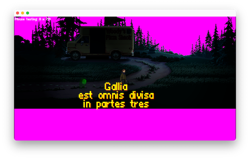

# Pictel

## Short Description

Simply put - it's a 2D game pixel-engine written in C++ that, in theory, should be compatible
with MacOS/iOS, Windows & Linux. Most of the engine is platform agnostic. Only a small, specific
parts of this software deal with the target platform like the actual renderer.

This is a work in progress. Work done in no particular order and no set end-goal in mind.
There's some metal in C++ implementation here. Some sprite management. Some LUA scripting
added to the project. In the worse case scenario maybe it helps someone that dreams
of building their own game engine from scratch ;)

## Idea behind it

The general idea is to... write a 2D game engine. Mostly for educational purposes.
The engine itself, as well as the first demo game, should be open-source and available
for everyone. Game engines should not be magic.

## Features/current state

The following is a partial, nowhere near complete, list of features and base
assumptions.

- [x] Written in C++
- [x] Simple Sprite Engine (load, show, move)
- [x] Simple Text Engine (load, show, move)
- [x] Simple Sound Engine (file stream audio, short clip play/pause)
- [ ] IMGUI for in-game control
- [x] MacOS/iOS Renderer
- [x] LUA as a script language (at least for now)
- [ ] Windows Renderer
- [ ] Linux Renderer

In other words the engine currently:
- initialises the graphics context
- draws sprites using Metal on MacOS/iOS
- has some sprite animation
- has some basic animation curves
- light up the 2d scene by means of shaders (simple luminosity added to the plane)
- deals with events (mouse, keyboards)
- has basic IMGUI implementation
- uses LUA to control the scene and provide functionality
- has test sprites taken off the internet to showcase the functions

## Scripting documentation

Can be found at [https://krzyspmac.github.io/Pictel/](https://krzyspmac.github.io/Pictel/)

## Licence

Copyright (c) 2022 Krzysztof Pawłowski

Permission is hereby granted, free of charge, to any person obtaining a copy
of this software and associated documentation files (the "Software"), to deal
in the Software without restriction, including without limitation the rights
to use, copy, modify, merge, publish, distribute, sublicense, and/or sell
copies of the Software, and to permit persons to whom the Software is
furnished to do so, subject to the following conditions:

The above copyright notice and this permission notice shall be included in all
copies or substantial portions of the Software.

THE SOFTWARE IS PROVIDED "AS IS", WITHOUT WARRANTY OF ANY KIND, EXPRESS OR
IMPLIED, INCLUDING BUT NOT LIMITED TO THE WARRANTIES OF MERCHANTABILITY,
FITNESS FOR A PARTICULAR PURPOSE AND NONINFRINGEMENT. IN NO EVENT SHALL THE
AUTHORS OR COPYRIGHT HOLDERS BE LIABLE FOR ANY CLAIM, DAMAGES OR OTHER
LIABILITY, WHETHER IN AN ACTION OF CONTRACT, TORT OR OTHERWISE, ARISING FROM,
OUT OF OR IN CONNECTION WITH THE SOFTWARE OR THE USE OR OTHER DEALINGS IN THE
SOFTWARE.